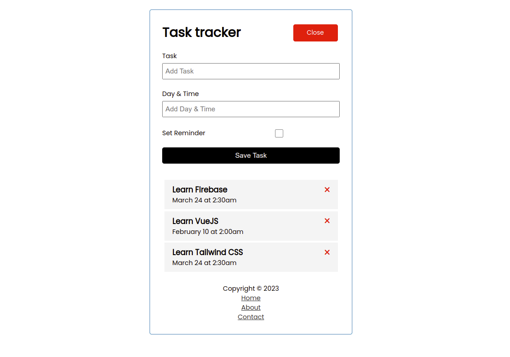

# Task Tracker



This is a task tracker application. I used this application to learn VueJS. You can add task and it is saved permanently imitating a backend using JSON server.

## Built With

- VueJS
- JSON Server


## Getting Started

To get a local copy up and running follow these simple example steps.

Clone the repo with `git clone https://github.com/HENRYKC24/Task-Tracker-VueJS.git`

## Project setup
```
npm install
```
## Run the json server as backend
```
npm run backend
```

### Compiles and hot-reloads for development
```
npm run serve
```

Open `http://localhost:8080/` on the browser

### Compiles and minifies for production
```
npm run build
```

### Customize configuration
See [Configuration Reference](https://cli.vuejs.org/config/).


That's it! You are ready to use the `Task Tracker` application


## Author

👤 **Henry Kc**

- GitHub: [@githubhandle](https://github.com/henrykc24)
- Twitter: [@twitterhandle](https://twitter.com/henrykc24)
- LinkedIn: [LinkedIn](https://linkedin.com/in/henry-kc)


## 🤝 Contributing

Contributions, issues, and feature requests are welcome!

Feel free to check the [issues page](https://github.com/HENRYKC24/Task-Tracker-VueJS/issues/).

## Show your support

Give a ⭐️ if you like this project!

## Acknowledgments

- A special thanks goes to Traversy Media for guiding me in this project.
- Thanks to every author whose code contributed to this project.

## 📝 License

This project is [MIT](./LICENSE) licensed.


